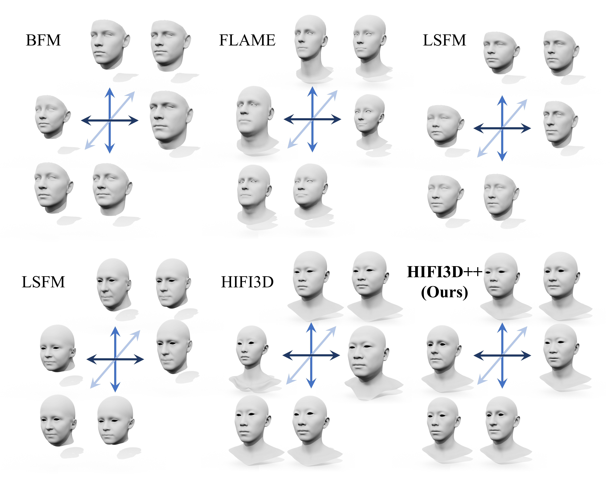

# HIFI3D++ 3D Morphable Model Documentation


This folder provides the 3DMM used in the following paper:

> **REALY: Rethinking the Evaluation of 3D Face Reconstruction**.\
> Zenghao Chai*, Haoxian Zhang*, Jing Ren, Di Kang, Zhengzhuo Xu, Xuefei Zhe, Chun Yuan, and Linchao Bao (* Equal contribution) \
> **ECCV 2022** \
> Project Page: https://www.realy3dface.com/ \
> arXiv: https://arxiv.org/abs/2203.09729


<p align="center"> 

</p>

## Introduction
The HIFI3D++ 3DMM is a full-head shape basis built from about 2,000 high quality topology consistent shapes by retopologizing [LYHM](https://www-users.cs.york.ac.uk/~nep/research/LYHM/), [FaceScape](https://facescape.nju.edu.cn/), and [HIFI3D](https://tencent-ailab.github.io/hifi3dface_projpage/). The comparison between previous 3DMMs and HIFI3D++ is summarized as follows.

|         |  BFM | FaceWarehouse | FLAME |  LSFM  |  LYHM | FaceScape | HIFI3D | HIFI3D<sup>A</sup> | HIFI3D++ |
|:-------:|:------:|:-------------:|:-----:|:------:|:-----:|:---------:|:------:|:--------:|:--------:|
| scans |   200  |      140      |  3,800 |  8,402  |  1,212 |    938    |   200  |    200   |   1,957   |
|   n<sub>v</sub>   |  53,215 |     11,510     |  5023 |  53,215 | 11,510 |   26,317   |  20,481 |   20,481  |   20,481  |
|   n<sub>f</sub>   | 105,840 |     22,800     |  9,976 | 105,840 | 22,800 |   52,261   |  40,832 |   40,832  |   40,832  |
| basis |   199  |       50      |  300  |   158  |  100  |    300    |   200  |    500   |    526   |

<i><small>HIFI3D<sup>A</sup> stands for the "augmented" version of HIFI3D, which employs data augmentation techniques to construct 3DMM from 200 scans.</small></i>

## Download

The HIFI3D++ 3DMM can be downloaded from [Google Drive](https://drive.google.com/file/d/1MBdk5fsUN1paSOszZYXfwTMehq51Z2kY/view?usp=sharing). If you need HIFI3D, HIFI3D<sup>A</sup>, or HIFI3D Albedo 3DMM, please refer to [HIFI3D](https://github.com/tencent-ailab/hifi3dface/tree/main/3DMM).

[Important] The HIFI3D++ 3DMM is for research purpose only.


## Usage
Please follow [HIFI3D](https://github.com/tencent-ailab/hifi3dface) to use our 3DMM. 


## Contact

If you have any question, please contact [Zenghao Chai](https://zenghaochai.com/) or [Linchao Bao](https://linchaobao.github.io/).


## Citation


If you use the 3DMM provided in this folder, please cite the following papers.

```
@inproceedings{REALY,
  title={REALY: Rethinking the Evaluation of 3D Face Reconstruction},
  author={Chai, Zenghao and Zhang, Haoxian and Ren, Jing and Kang, Di and Xu, Zhengzhuo and Zhe, Xuefei and Yuan, Chun and Bao, Linchao},
  booktitle = {Proceedings of the European Conference on Computer Vision (ECCV)},
  year = {2022}
}

@article{LYHM,
    title={Statistical Modeling of Craniofacial Shape and Texture},
    author={Dai, Hang and Pears, Nick and Smith, William and Duncan, Christian},
    journal={International Journal of Computer Vision},
    year={2019}
}

@inproceedings{FaceScape, 
    title={FaceScape: a Large-scale High Quality 3D Face Dataset and Detailed Riggable 3D Face Prediction}, 
    author={Yang, Haotian and Zhu, Hao and Wang, Yanru and Huang, Mingkai and Shen, Qiu and Yang, Ruigang and Cao, Xun}, 
    booktitle={Proceedings of the IEEE Conference on Computer Vision and Pattern Recognition (CVPR)}, 
    year={2020} 
}

@article{HIFI3D,
    title={High-Fidelity 3D Digital Human Head Creation from RGB-D Selfies},
    author={Bao, Linchao and Lin, Xiangkai and Chen, Yajing and Zhang, Haoxian and Wang, Sheng and Zhe, Xuefei and Kang, Di and Huang, Haozhi and Jiang, Xinwei and Wang, Jue and Yu, Dong and Zhang, Zhengyou},
    journal={ACM Transactions on Graphics},
    year={2021}
}

```


