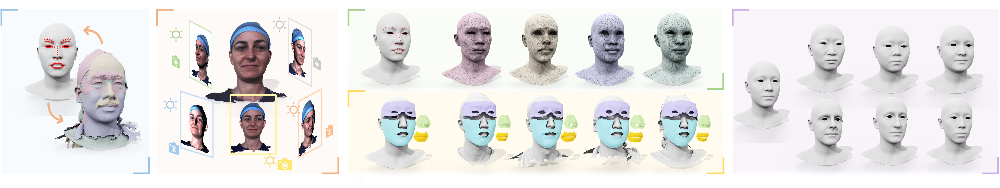

# REALY Benchmark

This is the official repository for 3D face reconstruction evaluation on the **Re**gion-**a**ware benchmark based on the **LY**HM Benchmark (REALY). The REALY benchmark aims to introduce a region-aware evaluation pipeline to measure the fine-grained normalized mean square error (NMSE) of 3D face reconstruction methods from under-controlled image sets.
<p align="center"> 

</p>


## Evaluation Metric

Given the reconstructed mesh from the 2D image in REALY by a specific method, the REALY benchmark calculates the similarity of ground-truth scans on four regions (nose, mouth, forehead, cheek) with the predicted mesh. The detailed evaluation pipeline is available in the REALY paper.

> **REALY: Rethinking the Evaluation of 3D Face Reconstruction**.\
> Zenghao Chai*, Haoxian Zhang*, Jing Ren, Di Kang, Zhengzhuo Xu, Xuefei Zhe, Chun Yuan, and Linchao Bao (* Equal contribution) \
> **ECCV 2022** \
> Project Page: https://www.realy3dface.com/ \
> arXiv: https://arxiv.org/abs/2203.09729

## Requirements
This evaluation implementation is tested under Windows, macOS, and Ubuntu environments. NO GPU is required.


## Installation
Clone the repository and set up a conda environment with all dependencies as follows:

> git clone https://github.com/czh-98/REALY \
> cd REALY \
> conda env create -f environment.yaml \
> conda activate REALY

- NOTE: for Windows, you need to install *scikit-sparse* according to the guidline [here](https://github.com/EmJay276/scikit-sparse).


## Evaluation
### 1. Data Preparation
- We have merged our benchmark to the Headspace dataset. Please sign the [Agreement](https://www-users.york.ac.uk/~np7/research/Headspace/) and indicate the usage of REALY benchmark according to their guideline, then you will get the permission to download the benchmark data.

- Download and unzip the benchmark file, you will find three folders, put the "REALY_HIFI3D_keypoints/" and "REALY_scan_region/" folders into "REALY/data/".

- Use the images in the "REALY_image/" folder to reconstruct 3D meshes with your method(s). We provide the cropped and the original + depth map versions (512x512), respectively. You may use them according to your need.

- [Important] Please save meshes as "\*.obj", where "\*" should have the same name as input images. NOTE: REALY is only suitable for meshes with the same topology. Please make sure the saved meshes share the same topology as your template mesh (e.g., if you use [Trimesh](https://trimsh.org/trimesh.html) to save meshes, please check whether you have set "process=False".)

### 2. Keypoints Preparation
- [Important] To make a more accurate alignment, we extend 68 keypoints to 85 with additional keypoints in the facial cheek. Prepare the 85 barycentric keypoints file. The example of HIFI3D topology can be found at "REALY/data/HIFI3D.obj" and corresponding barycentric coordinate "REALY/data/HIFI3D.txt". 
   
- [Optional] NOTE: If you use one of the same template(s) as the methods we compared in the paper (e.g., BFM09, Deep3D, 3DDFA_v2, FLAME, HIFI3D, etc.), you can use the predefined keypoints in "REALY/data/" folder directly; or you do not know how to export the barycentric file, you may ignore this step, and send one template mesh (".obj" file) to [Zenghao Chai](mailto:zenghaochai@gmail.com), and then the barycentric file will be sent back to you.

- Put your template mesh "\*.obj" and corresponding barycentric coordinate "REALY/data/*.txt" into "/REALY/data/".

### 3. Evaluation
- To evaluate the results on the frontal/multi-view image sets, run
```
python main.py --REALY_HIFI3D_keypoints ./data/REALY_HIFI3D_keypoints/ --REALY_scan_region ./data/REALY_scan_region --prediction <PREDICTION_PATH> --template_topology <TEMPLATE_NAME> --scale_path ./data/metrical_scale.txt --save <SAVE_PATH>
```

- Wait for the evaluation results, the NMSE of each region will be saved at "<SAVE_PATH>/REALY_error.txt", and the global aligned, regional aligned S<sub>P</sub><sup>\*</sup>, deformation S<sub>H</sub><sup>\*</sup>, and error map will be saved at "<SAVE_PATH>/region_align_save/".

- [Optional] If you want to present your method(s) on [REALY](https://www.realy3dface.com/), please send the reconstructed meshes and barycentric coordinate files to us, and we will re-evaluate and check the results. After that, we will update the project page accordingly.

## HIFI3D++
If you want to use the 3DMM introduced in this paper, please refer to the [instructions](./HIFI3D%2B%2B/README.md) and [demos](https://github.com/tencent-ailab/hifi3dface).

## Contact

If you have any question, please contact [Zenghao Chai](https://zenghaochai.com/) or [Linchao Bao](https://linchaobao.github.io/).


## Citation


If you use the code or REALY evaluation pipeline or results in your research, please cite:


```
@inproceedings{REALY,
  title={REALY: Rethinking the Evaluation of 3D Face Reconstruction},
  author={Chai, Zenghao and Zhang, Haoxian and Ren, Jing and Kang, Di and Xu, Zhengzhuo and Zhe, Xuefei and Yuan, Chun and Bao, Linchao},
  booktitle = {Proceedings of the European Conference on Computer Vision (ECCV)},
  year = {2022}
}
```


